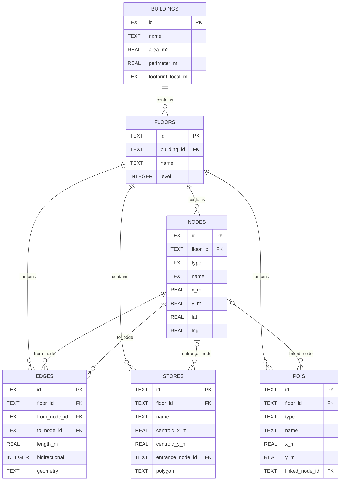

# FastAPI 요청 관통 흐름 — uvicorn부터 repository까지

> `GET /buildings/thehyundai-seoul` 요청 하나가 소켓에 도착해서 JSON 응답으로 나갈
> 때까지의 전체 경로와, 각 구간에서 알아야 하는 지식 정리. Spring 대응 개념을 `≒`로
> 병기한다. 기준 코드: `api/app/main.py`, `app/FastAPIConfig.py`,
> `app/router/buildingRouter.py`, `app/service/buildingService.py`.
> 최단 경로 알고리즘 기준 코드: `api/app/domain/dijkstra.py`.

## 0. 한 줄 대응표

| FastAPI 세계 | Spring 세계 |
|---|---|
| uvicorn | Tomcat (WAS) |
| ASGI 프로토콜 | Servlet 스펙 |
| `scope` dict / `Request` | `HttpServletRequest` |
| FastAPI `app` 객체 | DispatcherServlet + ApplicationContext |
| CORSMiddleware (미들웨어 스택) | Filter Chain |
| APIRouter / 경로 매칭 | HandlerMapping |
| `Depends()` | `@Autowired` (단, 기본 스코프가 요청) |
| Pydantic 바인딩/검증 | `@PathVariable`/`@RequestParam`/`@RequestBody` + Bean Validation |
| router 함수 | `@RestController` |
| `HTTPException` + 기본 핸들러 | `@ExceptionHandler` |
| `jsonable_encoder` + `JSONResponse` | Jackson `HttpMessageConverter` + `ResponseEntity` |
| lifespan | `@PostConstruct` / `@PreDestroy` |
| 환경변수/`.env` (pydantic-settings) | `application.yml` |

## 1. 데이터 객체 관계 ERD

현재 SQLite 스키마의 외래 키 관계는 다음과 같다.



관계 해석:

- 건물 하나는 여러 층을 가진다: `buildings 1 : N floors`.
- 층 하나는 여러 노드·간선·매장·POI를 가진다.
- 간선은 `from_node_id`, `to_node_id`로 두 노드를 연결한다.
- 매장은 선택적으로 입구 노드 하나를 참조한다.
- POI는 선택적으로 길찾기 노드 하나를 참조한다.

이 ERD는 **SQLite 테이블의 외래 키 관계**를 나타낸다. Python 도메인 객체를 다시
중첩된 Relation 그래프로 만들 필요는 없다. 현재 `Building`, `Floor`, `Node`, `Edge`,
`Store`, `Poi`는 외래 키 ID를 가진 평면 dataclass이며, 필요한 데이터 조합은
Repository의 SQL 조회와 Service 로직에서 수행한다.

```text
테이블 관계 표현    → ERD와 외래 키
데이터 조회·결합     → Repository SQL
업무 흐름 조합       → Service
최단 경로 계산       → dijkstra.py
화면 그래프 그리기   → Flutter
```

따라서 별도의 `relationships.py`나 객체 Relation 그래프는 현재 구조에 필요하지 않다.

### 평면 DB 컬럼과 Python 값 객체

SQLite는 조회와 인덱스 사용이 단순하도록 좌표를 평면 컬럼으로 유지한다.

```text
nodes.x_m, nodes.y_m
stores.centroid_x_m, stores.centroid_y_m
stores.entrance_x_m, stores.entrance_y_m
pois.x_m, pois.y_m
```

Repository가 row를 도메인 객체로 매핑할 때 반복되는 좌표 두 개를 `LocalPoint` 값
객체로 묶는다.

```python
@dataclass(frozen=True)
class LocalPoint:
    x_m: float
    y_m: float


node.position       # LocalPoint
store.centroid      # LocalPoint
store.entrance      # LocalPoint | None
poi.position        # LocalPoint
```

이 구조는 JPA `@Embeddable`과 목적이 비슷하지만 현재 프로젝트는 ORM을 사용하지
않으므로 Repository가 다음 변환을 명시적으로 수행한다.

```text
SQLite row: x_m=10.0, y_m=20.0
        ↓ Repository 매핑
Node(position=LocalPoint(x_m=10.0, y_m=20.0))
```

`LocalPoint`를 별도 테이블로 만들지는 않는다. 좌표는 독립 Entity가 아니라 Node,
Store, Poi에 종속된 값이므로 별도 테이블로 분리하면 불필요한 JOIN만 늘어난다.

## 2. 전체 관통 흐름 (요청 → 응답 왕복)

```text
 [Client (Flutter)]
        │
        │  ① GET /buildings/thehyundai-seoul  (TCP 바이트)
        ▼
┌────────────────────────────────────────────────────────────────────┐
│  uvicorn  ── ASGI 서버                                  ≒ Tomcat   │
│                                                                    │
│   HTTP 파싱 ──► scope dict 생성                                    │
│                 {method, path, headers, query_string, ...}         │
│                 ≒ HttpServletRequest 의 원재료                     │
│                                                                    │
│   단일 스레드 asyncio 이벤트 루프에서 모든 요청 처리               │
│   (Spring MVC 의 요청당-스레드 모델과 정반대, WebFlux 에 가까움)   │
└──────────────────────────────┬─────────────────────────────────────┘
                               │  ② await app(scope, receive, send)
                               │     ASGI 프로토콜 ≒ Servlet 스펙
                               │     receive = 바디 읽기, send = 응답 쓰기
                               ▼
┌────────────────────────────────────────────────────────────────────┐
│  FastAPI app  (FastAPIConfig.create_app())   ≒ DispatcherServlet   │
│                                                                    │
│  ┌──────────────────────────────────────────────────────────────┐  │
│  │  CORSMiddleware                           ≒ Servlet Filter  │  │
│  │                                                              │  │
│  │   요청 방향: OPTIONS preflight 이면 여기서 즉시 응답하고 끝  │  │
│  │   응답 방향: Access-Control-Allow-Origin 헤더 부착           │  │
│  │                                                              │  │
│  │  ┌────────────────────────────────────────────────────────┐  │  │
│  │  │  Router (Starlette)               ≒ HandlerMapping    │  │  │
│  │  │                                                        │  │  │
│  │  │   "/buildings/{building_id}" 패턴 정규식 매칭          │  │  │
│  │  │   등록 순서대로 첫 매칭 승리                            │  │  │
│  │  │   경로 없음 → 404 / 메서드 다름 → 405 (여기서 종료)    │  │  │
│  │  │                                                        │  │  │
│  │  │  ┌──────────────────────────────────────────────────┐  │  │  │
│  │  │  │  Depends 해석                  ≒ Spring DI      │  │  │  │
│  │  │  │                                                  │  │  │  │
│  │  │  │   get_building_service                           │  │  │  │
│  │  │  │      └─► get_building_repository                 │  │  │  │
│  │  │  │             └─► get_db (yield, 요청당 커넥션)    │  │  │  │
│  │  │  │   매 요청 새로 해석, 요청 내에서는 캐시           │  │  │  │
│  │  │  │   yield 의존성은 응답 후 finally 로 정리          │  │  │  │
│  │  │  └───────────────────────┬──────────────────────────┘  │  │  │
│  │  │                          ▼                             │  │  │
│  │  │  ┌──────────────────────────────────────────────────┐  │  │  │
│  │  │  │  Pydantic 바인딩/검증                            │  │  │  │
│  │  │  │  ≒ @PathVariable/@RequestParam + Bean Validation │  │  │  │
│  │  │  │                                                  │  │  │  │
│  │  │  │   building_id: str  ◄── URL 경로에서             │  │  │  │
│  │  │  │   q: str = ""       ◄── 쿼리스트링에서           │  │  │  │
│  │  │  │   (형 변환 실패 시 핸들러 실행 전에 422 차단)     │  │  │  │
│  │  │  └───────────────────────┬──────────────────────────┘  │  │  │
│  │  │                          ▼                             │  │  │
│  │  │      ★ sync/async 분기 (FastAPI 최대 함정) ★          │  │  │
│  │  │       def      → anyio 스레드풀에서 실행 (블로킹 OK)  │  │  │
│  │  │       async def → 이벤트 루프에서 직접 실행           │  │  │
│  │  │                   (블로킹 호출 시 서버 전체 정지!)     │  │  │
│  │  └──────────────────────────┬─────────────────────────────┘  │  │
│  └─────────────────────────────┼────────────────────────────────┘  │
└────────────────────────────────┼───────────────────────────────────┘
                                 │  ③ 여기부터 프레임워크 없음.
                                 │     그냥 Python 메서드 호출.
                                 ▼
      ┌───────────────────────────────────────────────┐
      │  buildingRouter.get_building()   ≒ Controller │
      │   HTTP ↔ 비즈니스 번역만.                      │
      │   service 가 None 주면 HTTPException(404)     │
      └──────────────────────┬────────────────────────┘
                             ▼
      ┌───────────────────────────────────────────────┐
      │  BuildingService                 ≒ Service    │
      │   비즈니스 로직. HTTP 를 모른다.               │
      │   repository "인터페이스"(Protocol)에만 의존   │
      │   없음 = None 반환 (이 코드베이스의 규약)      │
      └──────────────────────┬────────────────────────┘
                             ▼
      ┌───────────────────────────────────────────────┐
      │  SqliteBuildingRepository        ≒ Repository │
      │   SQL 실행 + row → domain 객체 매핑           │
      │   커넥션은 get_db 가 요청마다 열고 닫음        │
      │   (스레드풀 실행이라 커넥션 공유 금지)          │
      └──────────────────────┬────────────────────────┘
                             ▼
                   ┌───────────────────┐
                   │  sqlite3 (파일 IO) │
                   │  navigation.db     │
                   └───────────────────┘
```

## 3. 되돌아가는 길 (응답 방향)

```text
  repository ──domain 객체──► service ──dict──► router 반환
                                                   │
                                                   ▼
                            ┌─────────────────────────────────────┐
                            │  jsonable_encoder                   │
                            │   dict/Pydantic/datetime/Decimal    │
                            │   → JSON 직렬화 가능한 형태로 변환   │
                            │   ≒ Jackson ObjectMapper            │
                            └──────────────────┬──────────────────┘
                                               ▼
                            ┌─────────────────────────────────────┐
                            │  JSONResponse                       │
                            │   status / headers / body 조립      │
                            │   ≒ ResponseEntity                  │
                            │   (response_model 지정 시 스키마로   │
                            │    검증 + 선언 안 된 필드 필터링)    │
                            └──────────────────┬──────────────────┘
                                               ▼
                            ┌─────────────────────────────────────┐
                            │  CORSMiddleware (역방향 통과)        │
                            │   Access-Control-Allow-Origin 부착  │
                            └──────────────────┬──────────────────┘
                                               ▼
                            ┌─────────────────────────────────────┐
                            │  uvicorn                            │
                            │   ASGI send() 로 받은 것을           │
                            │   HTTP 상태줄/헤더/바디 바이트로 조립 │
                            └──────────────────┬──────────────────┘
                                               │  TCP
                                               ▼
                                        [Client (Flutter)]

  응답 전송이 끝난 뒤 → yield 의존성의 finally 실행 (DB 커넥션 close)
```

에러가 나는 경우의 경로:

```text
  검증 실패(타입 불일치 등)         ──► 핸들러 실행 전 차단 ──► 422 JSON
  HTTPException(404) raise         ──► FastAPI 기본 핸들러  ──► {"detail": "..."} JSON
                                       ≒ @ExceptionHandler 내장판
  처리 안 된 예외                  ──► 500 (스택트레이스는 서버 로그에만)
```

## 4. 다익스트라 경로를 API로 전달할 때의 흐름

현재 `api/app/domain/dijkstra.py`에는 순수 다익스트라 알고리즘만 구현되어 있다.
Service·Router·API 응답 연결은 아직 구현하지 않은 상태다. 연결할 때는 다음 흐름을
사용한다.

```text
[Flutter 경로 요청]
        │ start_node_id, end_node_id
        ▼
buildingRouter
        │ HTTP 요청 검증과 Service 호출
        ▼
BuildingService
        │ 어느 층의 그래프를 사용할지 결정
        ▼
SqliteBuildingRepository
        │ nodes, edges SQL 조회
        ▼
BuildingService
        │ find_shortest_path(nodes, edges, start, end)
        ▼
dijkstra.py
        │ ShortestPath(node_ids, edge_ids, total_distance_m)
        ▼
BuildingService
        │ node_ids를 좌표 또는 edge geometry로 변환
        ▼
buildingRouter
        │ Pydantic 응답 규약으로 JSON 반환
        ▼
[Flutter]
        └ 현재 층의 points/geometry를 Polyline으로 그림
```

계층별 책임:

| 계층 | 담당 | 담당하지 않는 것 |
|---|---|---|
| Repository | Node·Edge SQL 조회와 row 매핑 | 다익스트라 실행 |
| Service | 입력 검증, 그래프 조회 조합, 다익스트라 호출, 응답 데이터 가공 | HTTP 상태 코드 |
| Router | 요청 Body 검증, Service 호출, HTTP 응답·오류 변환 | 경로 계산 |
| Flutter | 경로 상태 저장, 현재 층 선택, Polyline·마커 렌더링 | 서버 SQL |

다익스트라는 다음 결과만 반환한다.

```python
ShortestPath(
    node_ids=("A", "B", "C"),
    edge_ids=("AB", "BC"),
    total_distance_m=5.0,
)
```

Flutter가 이미 전체 노드·간선 그래프를 내려받아 캐시했다면 `node_ids`와 `edge_ids`만
받아 좌표를 찾을 수 있다. 그래프를 캐시하지 않았다면 백엔드가 좌표까지 포함해
반환해야 한다.

```json
{
  "total_distance_m": 5.0,
  "node_ids": ["A", "B", "C"],
  "points": [
    {"node_id": "A", "x_m": 10.0, "y_m": 20.0},
    {"node_id": "B", "x_m": 15.0, "y_m": 25.0},
    {"node_id": "C", "x_m": 20.0, "y_m": 28.0}
  ]
}
```

경로가 복도 중심선을 따라 꺾여 있다면 노드 좌표를 단순 직선으로 연결하지 않고,
`edge_ids`에 해당하는 `geometry_local_m`을 진행 방향에 맞춰 합친 뒤 반환하는 것이
정확하다.

### DB 관점과 Python 메모리 관점의 탐색 차이

다익스트라는 테이블을 직접 한 행씩 탐색하지 않는다. DB와 Python의 역할은 명확히
분리된다.

| 관점 | 실제로 하는 일 |
|---|---|
| SQLite | `WHERE floor_id = ?` SQL로 필요한 Node·Edge 행을 조회 |
| Repository | 각 row를 `Node`, `Edge`, `LocalPoint` 객체로 변환 |
| Python Service | 조회 결과인 `list[Node]`, `list[Edge]`를 알고리즘에 전달 |
| 다익스트라 | `Edge` 목록으로 인접 리스트 `dict[node_id, neighbors]` 생성 후 메모리 탐색 |

```text
SQLite 테이블
    │ SELECT nodes, edges
    ▼
Repository
    │ row → Node/Edge/LocalPoint
    ▼
Python 메모리
    │ list[Node] + list[Edge]
    ▼
dijkstra.py
    │ dict 인접 리스트 + heapq 우선순위 큐 탐색
    ▼
ShortestPath
```

따라서 현재 방식은 **DB에서 그래프 데이터를 가져온 뒤 Python 컬렉션으로 객체
그래프를 만들어 탐색하는 방식**이다. DB는 데이터 선별과 저장을 담당하고, 최단
경로 계산은 Python 프로세스 내부 메모리에서 수행한다.

`LocalPoint`는 그래프 연결 관계를 표현하지 않는다. 다익스트라는 노드 ID와 간선의
`from_node_id`, `to_node_id`, `length_m`만 사용한다. 좌표는 가까운 시작 노드를 찾거나
최종 경로를 Flutter에 그릴 때 사용한다.

## 5. 단계별 상세 지식

### 0단계. 서버 기동 (요청이 오기 전)

`uvicorn app.main:app --reload` 실행 시:

1. uvicorn 이 `app.main` 모듈을 **import** → `create_app()` 실행
   (FastAPI 생성, `add_middleware`, `include_router`). Spring 의 ApplicationContext
   초기화에 해당하지만 **컴포넌트 스캔이 없다** — 전부 명시적으로 조립한다.
2. 소켓(기본 8000)을 열고 **asyncio 이벤트 루프** 시작.
3. 기동/종료 훅이 필요하면 `FastAPI(lifespan=...)` 에 등록
   (≒ `@PostConstruct`/`@PreDestroy`).

핵심: **ASGI** 는 "app 은 `await app(scope, receive, send)` 로 호출 가능한 객체"라는
서버-프레임워크 간 계약이다. `FastAPI` 인스턴스가 이 callable 이라서 uvicorn 외에
hypercorn 등 어떤 ASGI 서버에도 꽂힌다.

### 1단계. uvicorn — TCP → scope

HTTP 바이트를 파싱해 `scope`(dict) 를 만든다. method, path, 헤더, 쿼리스트링이
들어있는 `HttpServletRequest` 의 원재료다. FastAPI 핸들러에서 `request: Request` 를
받으면 이 scope 를 감싼 객체를 얻는다.

### 2단계. 미들웨어 (CORSMiddleware)

- `add_middleware` 로 등록한 것들이 앱을 양파처럼 감싼다. 요청은 바깥→안,
  응답은 안→바깥.
- CORSMiddleware 는 브라우저의 **preflight OPTIONS** 를 라우터 도달 전에 가로채
  즉시 응답하고, 실제 응답에는 `Access-Control-Allow-Origin` 을 붙인다.
- CORS 는 **브라우저 보안 모델**이다. Flutter 모바일 앱/curl 에는 관여하지 않고,
  웹 빌드로 테스트할 때만 문제가 된다.

### 3단계. 라우팅

- `APIRouter(prefix="/buildings")` + `@router.get("/{building_id}")` 는 include 시점에
  `/buildings/{building_id}` 정규식으로 컴파일된다.
- **등록 순서대로 첫 매칭 승리.** `/buildings/search` 같은 고정 경로는
  `/{building_id}` 보다 먼저 등록해야 한다 (Spring 과 달리 구체-경로-우선 규칙 없음).
- 경로 없음 → 404, 경로는 맞고 메서드 다름 → 405. 둘 다 라우터 단계에서 종료.

### 4단계. Depends (DI)

Spring DI 와 결정적으로 다른 점 3가지:

1. **기본 스코프가 싱글톤이 아니라 요청.** 매 요청 dependency 함수가 다시 불린다.
   (싱글톤이 필요하면 `@lru_cache` 를 붙이는 게 관례. 현재 코드는 커넥션이
   요청 스코프라 repository/service 도 요청 스코프로 둔다.)
2. **같은 요청 안에서는 동일 dependency 가 캐시**된다 (`use_cache=True` 기본).
3. **`yield` dependency** 로 자원 정리를 한다. 현재 `FastAPIConfig.get_db` 가 이 패턴:

```python
def get_db():
    conn = sqlite3.connect(get_db_path())
    conn.row_factory = sqlite3.Row
    try:
        yield conn          # ← 여기서 핸들러 실행
    finally:
        conn.close()        # ← 응답 전송 후 실행
```

### 5단계. 파라미터 바인딩 + 검증 (Pydantic)

타입 힌트만 보고 값의 출처를 결정한다:

| 시그니처 | 출처 | Spring |
|---|---|---|
| 경로 템플릿에 있는 이름 (`building_id: str`) | URL 경로 | `@PathVariable` |
| 경로에 없는 단순 타입 (`q: str = ""`) | 쿼리스트링 | `@RequestParam` |
| Pydantic 모델 타입 | 요청 바디 JSON | `@RequestBody` |
| `Depends(...)` | DI | `@Autowired` |

검증 실패는 핸들러 실행 전에 **422** 로 차단된다. domain 객체(순수 Python)와
요청 스키마(Pydantic)를 분리하는 이유는 Entity/DTO 분리 이유와 같다.

### 6단계. ★ sync vs async (가장 중요)

- **`def` 핸들러** → anyio **스레드풀**(기본 40)에서 실행. 블로킹 IO 안전.
- **`async def` 핸들러** → **이벤트 루프에서 직접** 실행. 내부에서 `sqlite3`,
  `requests`, `time.sleep()` 같은 블로킹 호출을 하면 **서버 전체가 정지**한다.

규칙: **블로킹 IO(`sqlite3`)를 쓰는 핸들러는 `def` 로 선언한다.**
`async def` 는 `httpx`, `aiosqlite` 처럼 await 가능한 라이브러리를 쓸 때만 쓴다.
"async 가 빠르겠지" 하고 `async def` + `sqlite3` 를 섞는 순간 성능이 무너진다.

### 7단계. router → service → repository

프레임워크 마법이 없는 순수 Python 구간. 계층별 계약:

- **router**: HTTP 만 안다. service 가 `None` 주면 `HTTPException(404)` 로 번역.
  비즈니스 로직 금지.
- **service**: HTTP 를 모른다 (`HTTPException` import 금지). repository
  **인터페이스**(Protocol)에만 의존. 없음 = `None` 반환이 규약.
- **repository**: SQL 과 row→domain 매핑만. 비즈니스 판단 금지.

SQLite + 스레드 지식:

1. `def` 핸들러는 스레드풀에서 돌므로 요청마다 스레드가 다를 수 있다.
   `sqlite3` 커넥션은 만든 스레드 밖에서 쓰면 `check_same_thread` 에러 →
   **요청당 커넥션 열고 닫기** (yield dependency). SQLite 는 파일이라 비용 무시 수준.
2. GIL 때문에 스레드풀도 CPU 병렬은 안 되지만, 우리 워크로드는 IO(파일 읽기) 위주 +
   다익스트라도 노드 234개 규모라 무관하다.

### 8단계. 직렬화

- 반환 dict/Pydantic 모델 → `jsonable_encoder` (datetime, Decimal 등 자동 변환)
  → `JSONResponse`.
- 데코레이터에 `response_model=...` 지정 시 응답을 그 스키마로 **검증 + 필터링**
  (선언 안 된 필드는 잘림 — 내부 필드 유출 방지 안전장치). 현재 코드는 미지정이라
  dict 가 그대로 나간다.

### 9단계. 반환

`JSONResponse` 가 미들웨어를 역순 통과(CORS 헤더 부착) → ASGI `send` → uvicorn 이
HTTP 바이트로 조립해 소켓에 쓴다. keep-alive 커넥션은 유지. yield dependency 의
`finally` 는 응답 전송 후 실행된다.

## 6. 꼭 기억할 것 7개

1. **uvicorn=Tomcat, FastAPI=Spring MVC, ASGI=Servlet 스펙, Pydantic=Jackson+Validation,
   Depends=DI** — 역할 대응만 잡으면 구조는 같다.
2. 단일 스레드 이벤트 루프가 기본. **블로킹 IO 핸들러는 반드시 `def`**
   (`async def` + `sqlite3` = 서버 정지).
3. Depends 는 **요청 스코프가 기본**, 싱글톤이 필요할 때만 `@lru_cache`.
4. 자원 정리는 **yield dependency** (커넥션 열기/닫기).
5. sqlite3 커넥션은 **스레드 간 공유 금지** → 요청당 연결.
6. 라우트는 **등록 순서 매칭** → 고정 경로를 파라미터 경로보다 먼저.
7. 테이블 관계는 **ERD+외래 키**, 경로 계산은 **다익스트라**, 실제 선 그리기는
   **Flutter**가 담당한다. 별도의 객체 Relation 그래프는 두지 않는다.
