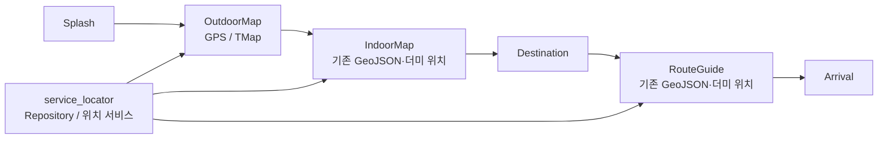
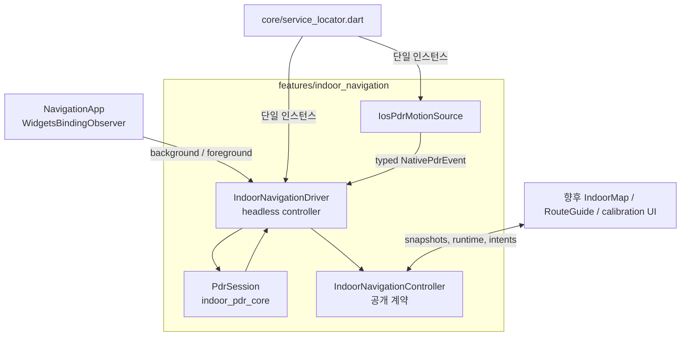
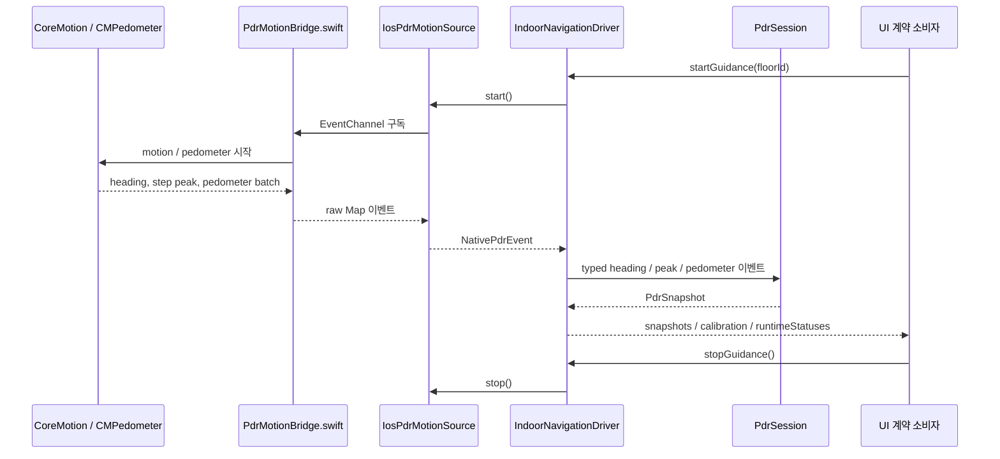
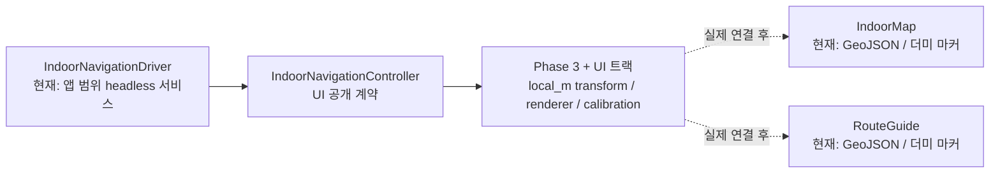

# PDR 앱 이식 구조와 기능 안내

> 기준 브랜치: `feature/pdr-indoor-navigation` · 기준일: 2026-07-11
> 대상: 앱 개발자, UI팀, 지도/node·백엔드 담당자

## 한눈에 보기

PDR(Pedestrian Dead Reckoning)은 GPS가 약한 실내에서 iPhone의 움직임·걸음 센서를 이용해
사용자의 **상대 이동 거리와 방향**을 계산하는 모듈이다. 이번 이식으로 iOS 센서부터 Flutter
앱의 PDR snapshot까지의 경로는 연결·검증됐다.

다만 아직 기존 `IndoorMap`/`RouteGuide` 화면이 PDR을 시작하거나 위치를 지도에 그리지는 않는다.
PDR 결과는 세션 시작점을 원점으로 하는 `PdrLocalPoint`(미터)이고, 실제 층 지도 `local_m` 좌표로
올리는 anchor·node 정합은 Phase 3 범위다.

| 구분 | 현재 상태 |
|---|---|
| iOS 센서 → PDR 계산 → snapshot | 완료 및 iPhone 실기기 검증 |
| 앱 background/foreground lifecycle | 완료 |
| UI가 사용할 공개 계약 | 완료 |
| IndoorMap/RouteGuide에서 안내 시작·위치 표시 | 아직 미연결 |
| floor node/local_m 기반 실제 지도 좌표 정합 | Phase 3 대기 |
| Android | 미구현 |

## 1. 기존 앱 구조

기존 Flutter 앱은 화면 라우팅과 repository 중심으로 실외·실내 안내 화면을 제공한다.



### 기존 실내 화면의 한계

- `IndoorMap`과 `RouteGuide`는 `FloorPlan.fromGeoJson()`의 `LatLng` 모델을 사용한다.
- 현재 실내 위치 마커는 corridor 또는 POI 첫 좌표를 쓰는 더미 값이다.
- 이 좌표계는 PDR이 내보내는 미터 기반 좌표와 다르다.

따라서 PDR을 단순히 기존 `LocationMarker`에 넣으면 안 된다. 먼저 PDR 로컬 미터를 floor `local_m`으로
변환하고, UI팀의 meter-space 렌더러가 이를 그려야 한다.

## 2. PDR은 앱 어디에 붙었나

PDR은 특정 화면의 `State`가 아니라 **앱 범위 단일 세션 서비스**로 붙었다.



### 실제 연결 지점

| 기존 앱 위치 | PDR가 붙은 방식 | 역할 |
|---|---|---|
| `client/lib/core/service_locator.dart` | `pdrMotionSource`, `indoorNavigationDriver` 전역 단일 인스턴스 | 화면 전환 중에도 같은 센서 세션을 유지 |
| `client/lib/app.dart` | `WidgetsBindingObserver` | background에서 pause/센서 stop, foreground에서 센서 start/resume |
| `client/ios/Runner/AppDelegate.swift` | Flutter EventChannel/MethodChannel 등록 | iOS native bridge와 Dart 연결 |
| `client/ios/Runner/PdrMotionBridge.swift` | CoreMotion·CMPedometer 수집 | heading, step peak, pedometer batch를 EventChannel으로 전달 |
| `client/lib/features/indoor_navigation/` | platform/application/contract 계층 | raw sensor → typed event → PDR 계산 → UI 계약 |

## 3. 센서부터 UI 계약까지의 데이터 흐름



### 계층별 책임

| 계층 | 주요 파일 | 하는 일 | 하지 않는 일 |
|---|---|---|---|
| Native iOS | `ios/Runner/PdrMotionBridge.swift` | CoreMotion, CMPedometer, native peak 수집 | 지도·UI·경로 렌더링 |
| Platform adapter | `platform/ios_pdr_motion_source.dart`, `native_pdr_event.dart` | EventChannel raw Map을 typed 이벤트로 변환 | PDR 수학·UI 상태관리 |
| PDR core | `packages/indoor_pdr_core/` | 걸음·보폭·heading·초록/주황 경로·품질 계산 | Flutter, 플랫폼 채널, 지도, GPS export |
| App controller | `application/indoor_navigation_controller.dart` | 세션 lifecycle, 오류 상태, calibration, snapshot 전달 | 위젯·지도 그리기 |
| Public contract | `contract/` | UI가 구독·호출할 타입만 노출 | 구현체 내부 노출 |
| UI / 지도 | 별도 트랙 | meter-space 렌더러, 핀·방향 보정 UX | 센서·PDR 계산 소유 |

## 4. PDR이 제공하는 기능

### 위치·경로

`PdrSnapshot`은 세션 시작점을 `(0, 0)`으로 하는 로컬 미터 좌표를 제공한다.

- `position`, `path`: **confirmed(초록)** 위치·경로. 제품 위치 판단의 기준이다.
- `preview`: **accel preview(주황)** 위치·경로. 실시간 보조 품질 신호이며 초록 위치와 평균내거나
  자동 전환하지 않는다.
- `steps`, `distanceM`, `walkingHeadingDeg`: 보행량과 진행 방향이다.

### 센서 실행 상태와 오류

`PdrRuntimeStatus`는 UI가 센서 상태를 표시하거나 오류를 안내할 수 있게 한다.

| 상태 | 의미 |
|---|---|
| `idle` | 안내·센서 세션이 꺼져 있음 |
| `starting` | EventChannel을 열고 첫 이벤트를 기다림 |
| `running` | native 이벤트를 PDR core로 전달 중 |
| `paused` | 앱 background로 tracking·센서를 멈춤 |
| `stopping` | 명시적 종료 처리 중 |
| `degraded` | 권한·센서·채널 오류로 정상 추적을 보장할 수 없음 |

오류가 발생하면 warning code가 runtime status와 이후 snapshot quality에 함께 들어간다. 예를 들어
`sensorStartFailed`, `sensorStreamError`, `sensorResumeFailed`가 있다.

### 캘리브레이션과 anchor

PDR 좌표는 지도 좌표가 아니므로, 지도에 표시하기 전에 anchor가 필요하다.

```text
floorPoint = R(rotationDeg) × pdrPoint + anchorLocalM
```

- 사용자가 지도에서 현재 위치를 찍으면 `confirmAnchorByPin()`으로 평행이동 기준을 정한다.
- heading reference가 arbitrary이면 `confirmAnchorByHeading()`으로 회전도 정한다.
- anchor가 확정되기 전 `canRenderPosition`은 false다. UI는 위치 마커를 그리면 안 된다.

현재 타입과 기본 변환 함수는 있지만, 실제 floor node/local_m 데이터로 축·원점·회전을 검증하는 작업은
Phase 3에 남아 있다.

## 5. 기존 화면과의 현재 관계



현재 앱에서 `startGuidance()`를 호출하는 production 화면은 없다. 실기기 검증용 standalone harness만
PDR 세션을 시작한다. 즉 다음 화면 작업은 PDR을 새로 만드는 일이 아니라, 이미 이식된 서비스를
사용자 흐름에 연결하는 일이다.

## 6. UI·지도 팀이 붙을 때의 사용 규칙

UI는 구현체 파일이 아니라 아래 barrel만 의존한다.

```dart
import 'package:navigation_client/features/indoor_navigation/contract/indoor_navigation_contract.dart';
```

권장 흐름은 다음과 같다.

1. 실내 안내 진입 시 앱 범위 `IndoorNavigationController`에 `await startGuidance(floorId: ...)`를 호출한다.
2. `runtimeStatuses`가 `running`이 될 때까지 센서 준비 상태를 표시한다.
3. `calibration`이 `awaitingPin`이면 floor map에서 사용자가 현재 위치를 찍게 한다.
4. `confirmAnchorByPin()` 또는 필요 시 `confirmAnchorByHeading()`을 호출한다.
5. `canRenderPosition == true`가 된 뒤에만 `snapshot.position`을 floor `local_m`로 변환해 렌더링한다.
6. IndoorMap ↔ RouteGuide 화면 전환 중에는 stop/reset하지 않는다.
7. 실내 안내 종료에서만 `await stopGuidance()`를 호출한다.

## 7. Phase 3 전에 node 팀과 맞춰야 할 계약

실제 지도 위 위치 표시는 다음 정보가 없으면 정확하게 검증할 수 없다.

| 필요한 node/floor 데이터 | 용도 |
|---|---|
| `floorId`, node id, `x`, `y` | PDR 결과를 올릴 floor `local_m` 기준점 |
| 좌표 단위(m) | px·LatLng와 혼용 방지 |
| 원점·축 규약 | east/north 방향과 부호 확정 |
| `north_alignment` | PDR heading과 floor 축의 회전 차이 |
| 입구·시작 node | 자동 또는 핀 기반 anchor 후보 |

edge/route geometry는 route snapping·map matching에는 필요하지만, 첫 위치 표시에는 위 node 좌표가
우선이다.

## 8. 검증 상태

| 검증 | 결과 |
|---|---|
| `indoor_pdr_core` | 10 tests 통과, analyze clean |
| client PDR·lifecycle·harness | 27 tests 통과, PDR 경로 analyze clean |
| iOS simulator | debug build 통과 |
| iPhone 13 Pro | 무선 profile harness PASS: 8걸음, 5.81m, warning 0건, stop 후 이벤트 중단 확인 |

전체 `flutter analyze`의 기존 19건은 별도 미추적 API/map/riverpod WIP에서 발생하며 PDR 변경 경로에는
새 오류가 없다.

## 참고 파일

- [전체 이식 계획](pdr-migration-plan.md)
- [UI 연동 계약](pdr-ui-contract.md)
- [PDR 공개 계약](../client/lib/features/indoor_navigation/contract/indoor_navigation_contract.dart)
- [앱 범위 controller](../client/lib/features/indoor_navigation/application/indoor_navigation_controller.dart)
- [iOS native bridge](../client/ios/Runner/PdrMotionBridge.swift)
